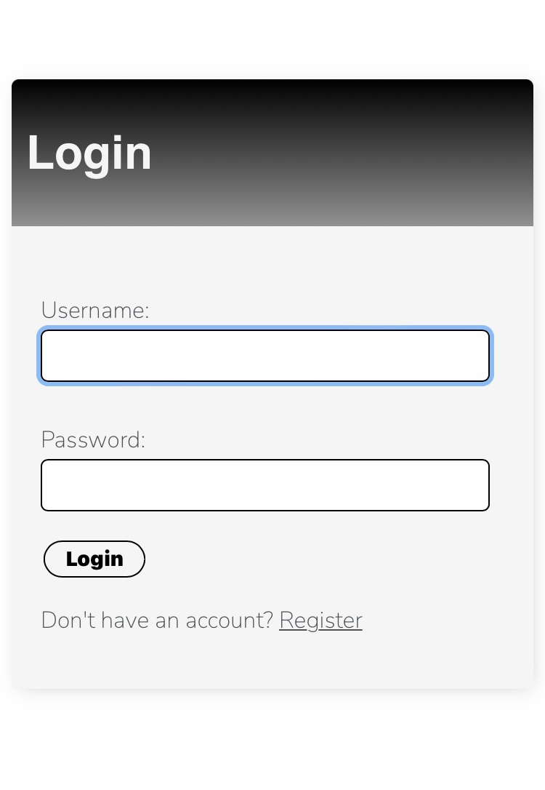
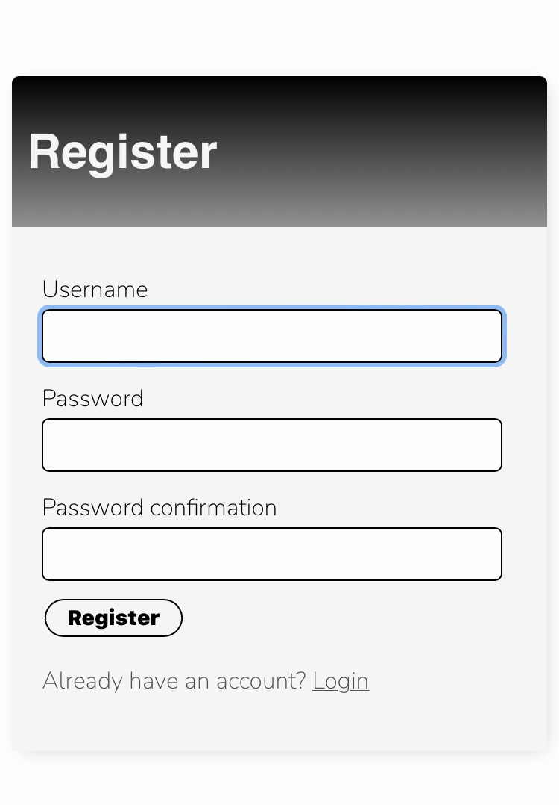
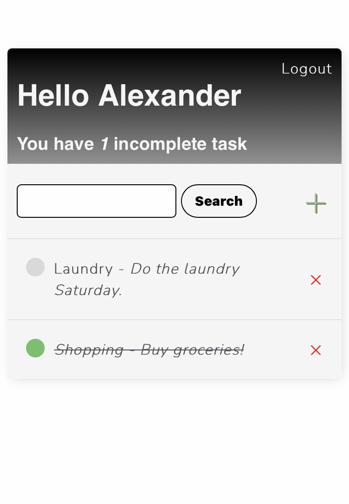
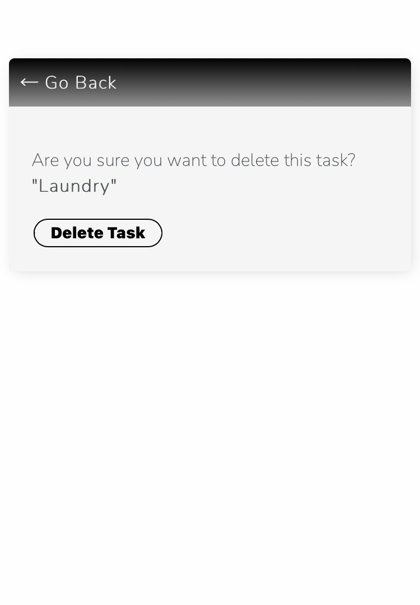
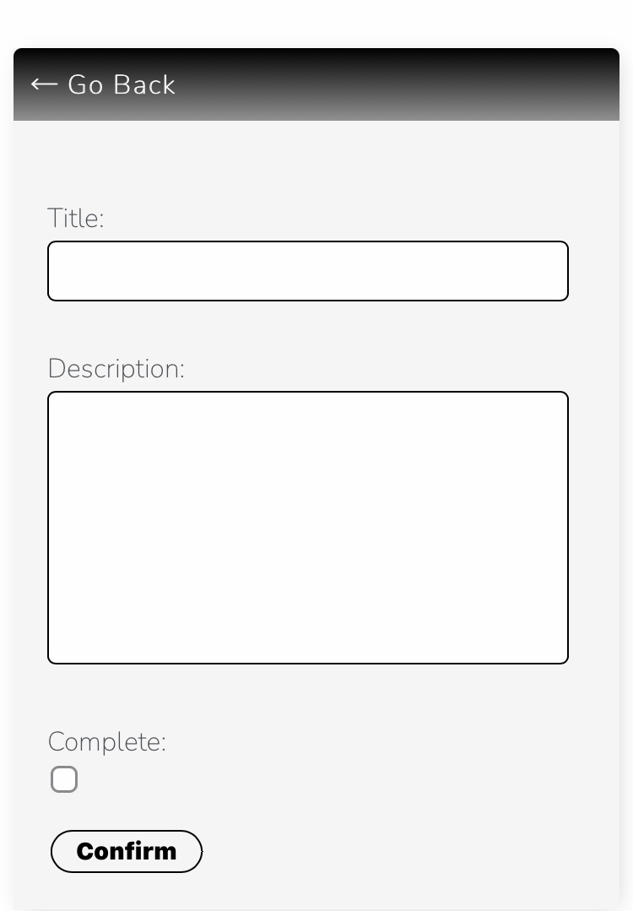
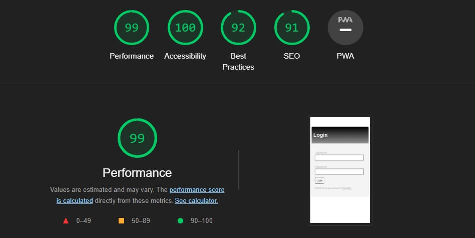

# **TodoList.com**
TodoList.com is an app where you can keep track of your daily tasks.

## Live Site
[TodoList.com](https://todo-list-94.herokuapp.com/login/)

## Repository
[TodoList Repository](https://github.com/Madebybrown/TodoList.com)

## Table Of Contents
- [Testing & Features](#testing--features)
    - [Login Page](#login-page)
    - [Register Page](#register-page)
    - [Task List Home Page](#task-list-home-page)
    - [Add Task Page](#add-task-page)
    - [Lighthouse Test](#lighthouse-test)
- [Future Features](#future-features)
- [Deployment](#deployment)
- [Technologies Used](#technologies-used)
- [Credit Section](#credit-section)

 

## Key Goals
- To showcase my competency as a developer using Django.
- To problem solve and tackle challenges that force me to learn more about good coding practices.

### External Goals
- To create an app that solves the problem of keeping track of tasks during the day.

 

## Target Audience

People who need to keep track of their tasks during the day

 

## **Testing & Features**

 

### **Login Page:**

 

**Login Button** | 

1 - Feature is expected to promt the user to insert a username and password when the user tries to log in without entering a username and password.
    
- *Tested the feature by trying to login without entering a username and a password.*

- *The feature acted as expected and promted the user to insert a username and a password.*

2 - Feature is expected to take the user to the tasklist page when clicked if the fields are filled with an authorized username and password.

- *Tested the feature by trying to login with a authurized username and password*.

- *The feature acted as normally and took the user to the tasklist page.*

3 - Feature is expected to display a message saying *"Please enter a correct username and password. Note that both fields may be case-sensitive"* when the fields are filled with an unauthorized username and password when clicked.

- *Tested the feature by trying to login with an unauthurized username and password*.

- *The feature acted as normally and displayed the message *"Please enter a correct username and password. Note that both fields may be case-sensitive"*.*

**Register Link** | 

1 - Feature is expected to take the user to a register form when the user clicks the link.

- *Tested the feature by clicking it.*

- *The feature acted as normally and it took the user to a register form.*

 

### **Register Page:**

 

**Register Button** | 

1 - Feature is expected to promt the user to insert a username and password when the user tries to register without entering a username and password.
    
- *Tested the feature by trying to register without entering a username and a password.*

- *The feature acted as expected and promted the user to insert a username and a password.*

2 - Feature is expected to take the user to the TaskList Home Page when clicked if the fields are filled with an authorized username and password.

- *Tested the feature by trying to login with a authurized username and password*.

- *The feature acted as normally and took the user to the TaskList Home Page.*

 

### **Task List Home Page:**

 

**Logout Link** | 

1 - Feature is expected to logout the user and take them to the login page.
    
- *Tested the feature by trying to click the logout link.*

- *The feature acted as expected, it logged out the user and took them to the login page.*

**Add Task Item Symbol** | 

1 - Feature is expected to take the user to an add task item form.
    
- *Tested the feature by trying to click it.*

- *The feature acted as expected, it took the user to an add task item form.*

**Delete Task Item Symbol** | 

1 - Feature is expected to take the user to a new page and display the message "Are you sure you want to delete this task? "TASK_NAME"."
    
- *Tested the feature by trying to click it.*

- *The feature acted as expected, it took the user to a new page and displayed the message.*

    

    - **Delete Task Button**

        1 - Feature is expected to delete the item and take the user back to the TaskList Home Page.
    
        - *Tested the feature by trying to click it.*

        - *The feature acted as expected, it deleted the item and took the user back to the TaskList Home Page.*

**Search Bar** | 

1 - Feature is expected to sort task items based on what letter they start with.
    
- *Tested the feature by entering a letter and clicked search.*

- *The feature acted as expected, it sorted the tasks and displayed only the words starting with the entered letter.*

**Edit Item** | 

1 - Feature is expected to take the user to a form where they can edit the task item.
    
- *Tested the feature by clicking the task name.*

- *The feature acted as expected, it took the user to a form where they can edit the task item.*

 

### **Add Task Page:**

 

**Go Back Link** | 

1 - Feature is expected to take the user back to the TaskList Home Page.
    
- *Tested the feature by trying to click it.*

- *The feature acted as expected, it took the user to the TaskList Home Page.*

**Confirm Button** | 

1 - Feature is expected to promt the user to insert a title when the user tries to confirm the form with empty fields.
    
- *Tested the feature by trying to confirm the form with empty fields.*

- *The feature acted as expected and promted the user to insert a title on the form.*

2 - Feature is expected to take the user to the tasklist page when clicked if the title field is filled.

- *Tested the feature by trying to confirm the form with a title*.

- *The feature acted as normally and took the user to the tasklist page.*

 

### **Lighthouse Test:**

- The scan came out like this.

 

## **Future Features:**
- Complete Tasks - The ability to complete tasks with one quick click.
- Task Editing - The ability to edit tasks by long pressing the task name.

## **Deployment:**
The project was deployed using Heroku.
 - Steps for deployment:
    - First, when on the Heroku dashboard, click new up to your right-hand side, this will toggle a drop down.
    - Click on "Create new app", this will take you to a new page.
    - Here you choose your app name, and your region, and then you click "Create app" down on the left-hand side, this will take you to a new page.
    - On this page, you first click on the settings tab.
    - Here you scroll down until you see the button with "Reveal Config Vars" on it, click it!
    - Write you environment variables here and press add. 
    - Now scroll up to the top of the page and press the "Deploy" tab and then press GitHub.
    - Search for the repository you want to deploy.
    - Press connect.
    - Scroll down until you find "Enable Automatic Deploys" and "Deploy Branch", press them, and wait while your app is building.
    - Building app
    - App build is finished

## **Technologies Used:**
- [HTML5](https://sv.wikipedia.org/wiki/HTML5) - Provides structure and content to site
- [CSS](https://en.wikipedia.org/wiki/CSS) - To give HTML style rules
- [Github](https://github.com/) - Used to start the project and deploy
- [Gitpod](https://www.gitpod.io/) - Used to host and create the site
- [Google Fonts](https://fonts.google.com/about) - Import fonts to the site

## **Credit Section:**
- [Class Based Views](https://dennisivy.com/django-class-based-views) - Working with class based views
- [Class ListView](https://ccbv.co.uk/projects/Django/3.1/django.views.generic.list/ListView/) - Understanding the class ListView

## [Back To The Top](#todolistcom)